# EKS Microservices Commerce Platform

A production-oriented, cloud-native e-commerce platform built as seven containerized microservices on **Amazon EKS**. The repository demonstrates end-to-end platform engineering: modular Terraform infrastructure, GitOps-driven Kubernetes deployments, automated CI/CD with image scanning, TLS-terminated ingress, and a Prometheus/Grafana observability stack.

---

## Short Description

This project implements a full-stack microservices storefront with user authentication, product browsing, cart management, checkout, simulated payment, and order notifications. It was built to practice and document real-world DevOps workflows—provisioning AWS infrastructure as code, shipping services through a container pipeline, and operating them on Kubernetes with declarative GitOps rather than manual `kubectl apply` deployments.

The platform runs on a private-subnet EKS cluster backed by Multi-AZ RDS PostgreSQL, exposes HTTPS endpoints through NGINX Ingress with automated DNS and certificate management, and keeps cluster state aligned with Git using Argo CD.

---

## Badges


---

## Table of Contents

- [Project Overview](#project-overview)
- [Key Features](#key-features)
- [Architecture](#architecture)
- [CI/CD Pipeline](#cicd-pipeline)
- [Technology Stack](#technology-stack)
- [Repository Structure](#repository-structure)
- [Getting Started](#getting-started)
- [Usage](#usage)
- [Configuration](#configuration)
- [Infrastructure](#infrastructure)
- [Security](#security)
- [Monitoring & Logging](#monitoring--logging)
- [Testing](#testing)
- [Screenshots](#screenshots)
- [Challenges & Solutions](#challenges--solutions)
- [Lessons Learned](#lessons-learned)
- [Future Improvements](#future-improvements)
- [Contributing](#contributing)
- [License](#license)
- [Author](#author)

---

## Project Overview

### Background

Microservice architectures are straightforward to diagram but difficult to operate. This repository closes that gap by pairing a working commerce application with the surrounding platform machinery—VPC networking, managed Kubernetes, relational storage, image registries, ingress controllers, certificate automation, and observability tooling.

### Purpose

The primary goal is to demonstrate how application code and platform configuration evolve together in a Git-centric workflow. Infrastructure changes flow through Terraform pipelines; application changes flow through Docker builds and Helm value updates; Argo CD reconciles the cluster against the repository.

### Objectives

- Deploy seven independent services on EKS with Helm umbrella charts
- Provision AWS infrastructure using reusable Terraform modules
- Automate image build, vulnerability scan, and ECR push via GitHub Actions
- Implement GitOps deployments with Argo CD and automated image tag promotion
- Terminate TLS and manage DNS records without manual intervention
- Provide cluster- and workload-level metrics through Prometheus and Grafana

### Use Case

Suitable as a portfolio reference for platform engineering, DevOps, and SRE roles. The project covers the full delivery path from commit to running pods, not just application code in isolation.

### Target Audience

- Recruiters and hiring managers evaluating cloud-native delivery experience
- Engineers preparing for interviews involving Kubernetes, Terraform, or CI/CD design
- Developers learning how microservices are packaged and operated in AWS

---

## Key Features

### Application

- React storefront with authentication, product catalog, cart, checkout, and order history
- JWT-based auth service with bcrypt password hashing and PostgreSQL persistence
- Inter-service communication over HTTP with bearer tokens and internal `x-user-id` headers
- Simulated payment processing and console-based notification delivery

### Infrastructure

- Multi-AZ VPC with public/private subnets, NAT Gateway, and VPC Flow Logs
- Amazon EKS cluster with encrypted secrets (KMS), control-plane logging, and managed node group
- RDS PostgreSQL (Multi-AZ, encrypted storage, Performance Insights, enhanced monitoring)
- Remote Terraform state in S3 with versioning and encryption
- ECR repositories with scan-on-push and lifecycle policies

### Deployment & Automation

- GitHub Actions matrix builds for all seven services
- Trivy container scanning (CRITICAL/HIGH severities)
- Automated Helm `values.yaml` image tag updates committed back to `main`
- Argo CD root application pattern with separate app and infrastructure Application CRs
- Rolling updates via Kubernetes Deployments

### Security

- Checkov static analysis in Terraform CI and pre-commit hooks
- Least-privilege RDS security group (PostgreSQL ingress from EKS security group only)
- cert-manager ClusterIssuer with Let's Encrypt DNS-01 via Cloudflare
- Kubernetes Secrets for database credentials and JWT signing keys
- Pre-commit hooks for private-key detection, YAML validation, and Dockerfile linting

### Observability

- kube-prometheus-stack (Prometheus + Grafana)
- HTTPS ingress for Grafana, Prometheus, and Argo CD on dedicated subdomains
- Per-service `/health` endpoints
- EKS control-plane audit and API logs enabled

---

## Architecture

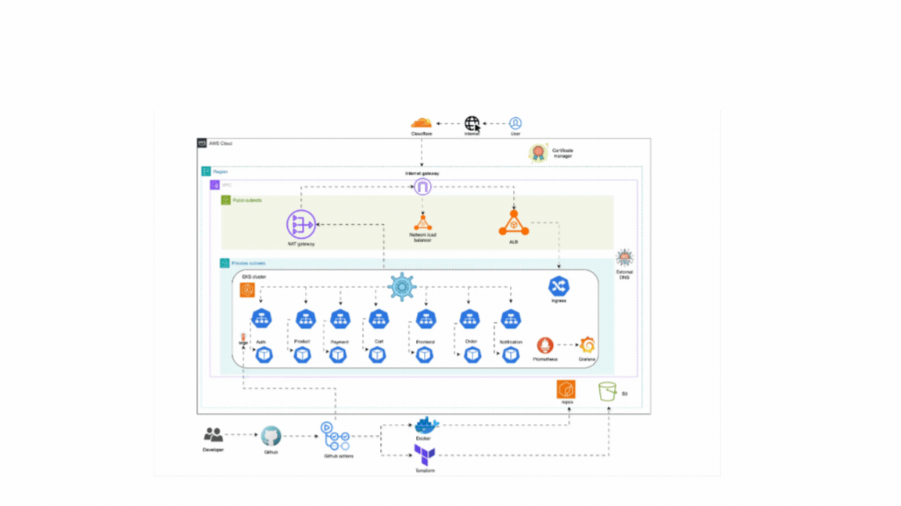

### Components

| Layer | Component | Role |
| --- | --- | --- |
| Edge | NGINX Ingress Controller | TLS termination and path-based routing to services |
| Edge | ExternalDNS + Cloudflare | Creates/updates DNS records from Ingress resources |
| Edge | cert-manager | Issues and renews Let's Encrypt certificates |
| Application | Frontend (React + nginx) | Serves the SPA and proxies user traffic |
| Application | Auth Service | Signup, login, JWT issuance; stores users in `auth_db` |
| Application | Product Service | Product catalog from DummyJSON API with local fallback |
| Application | Cart Service | In-memory per-user cart state |
| Application | Order Service | Orchestrates checkout; persists orders in `order_db` |
| Application | Payment Service | Simulated payment authorization |
| Application | Notification Service | Simulated email notifications (console log) |
| Data | Amazon RDS PostgreSQL | Shared instance hosting `auth_db` and `order_db` |
| Platform | Argo CD | GitOps reconciliation for Helm chart and infra manifests |
| Platform | Amazon ECR | Container image registry |
| Observability | Prometheus / Grafana | Metrics collection and dashboards |

### Request Flow

```text
Browser
  │
  ▼
NGINX Ingress (baashe.uk)
  ├── /              → frontend:80
  ├── /api/auth      → auth:8080
  ├── /api/cart      → cart:8081
  ├── /api/order     → order:8083
  ├── /api/payment   → payment:8084
  └── /api/product   → product:8085

Order Service (checkout)
  ├── GET  cart-service/cart
  ├── POST payment-service/pay
  ├── INSERT order_db
  ├── DELETE cart-service/cart/clear
  └── POST notification-service/notify
```

### Deployment Flow

```text
Developer push (main)
        │
        ▼
GitHub Actions ──build/scan──▶ Amazon ECR
        │
        │  yq updates kubernetes/helm/values.yaml (image tag = commit SHA)
        ▼
Git commit to main
        │
        ▼
Argo CD detects drift ──sync──▶ EKS (Helm release: ecommerce-app)
        │
        ▼
Kubernetes rolling update of Deployments
```

### GitOps Layout

Argo CD uses an app-of-apps pattern defined under `gitops/`:

- **root-app** — watches `gitops/` and installs child Applications
- **ecommerce-site** — deploys the Helm umbrella chart from `kubernetes/helm/`
- **infrastructure** — recursively applies platform manifests from `kubernetes/` (excluding `helm/`)

---

## CI/CD Pipeline

### Application Pipeline (`docker-build-push.yaml`)

**Trigger:** Push to `main` affecting `services/**` or `kubernetes/helm/**`

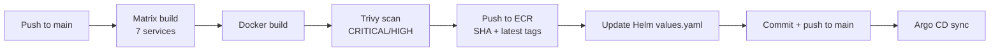

| Stage | Tool | Details |
| --- | --- | --- |
| Checkout | GitHub Actions | `actions/checkout@v4` |
| AWS auth | `configure-aws-credentials` | `us-east-1` region |
| Build | Docker | Context: `./services/<service>` |
| Scan | Trivy | OS and library vulnerabilities; non-blocking (`exit-code: 0`) |
| Push | ECR | Repository naming: `<service>-service` |
| GitOps update | `yq` | Sets `global.image.tag` to `${{ github.sha }}` |
| Commit | `GITOPS_PAT` | Message: `chore(gitops): deploy version <sha> [skip ci]` |

**Services in matrix:** `auth`, `cart`, `frontend`, `notification`, `orders`, `payment`, `product`

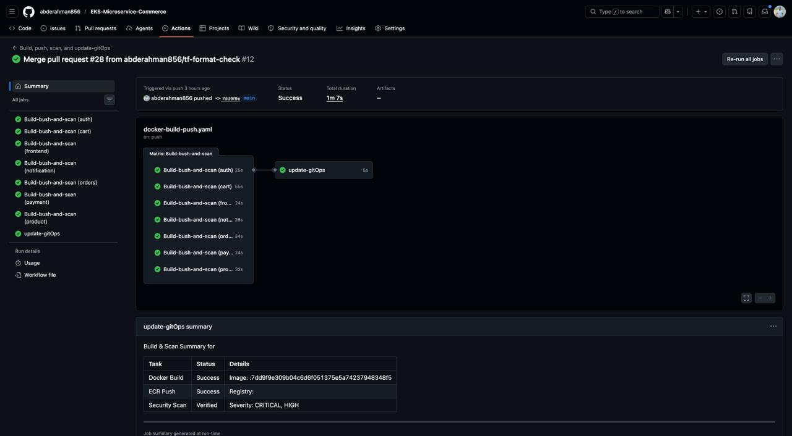

### Infrastructure Pipelines

#### Plan (`infrastructure-plan.yaml`)

**Trigger:** Push or pull request to `main` when `terraform/**` changes

1. `terraform fmt -check`
2. `terraform init` + `validate`
3. Checkov security scan (`soft_fail: true`)
4. `terraform plan -out=tfplan`
5. Job summary posted to GitHub Actions

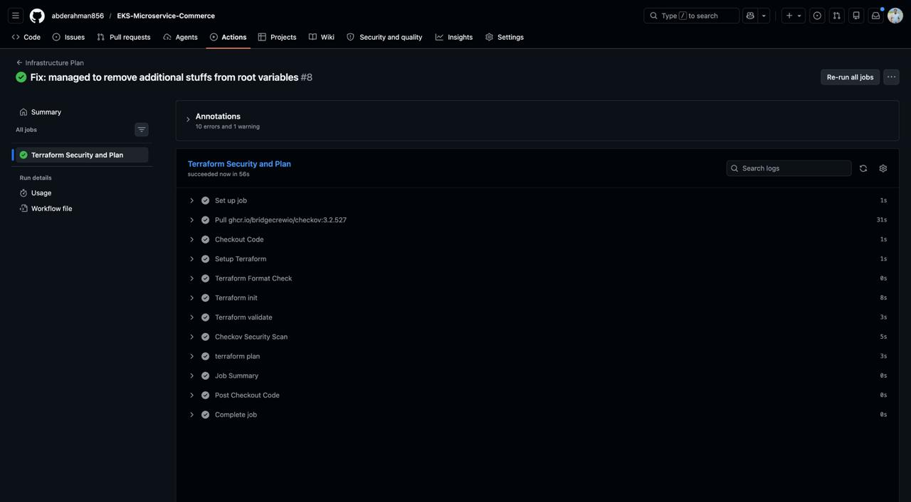

#### Apply (`infrastructure-apply.yaml`)

**Trigger:** Manual `workflow_dispatch` (production safety)

1. `terraform init`
2. `terraform validate`
3. `terraform apply -auto-approve`

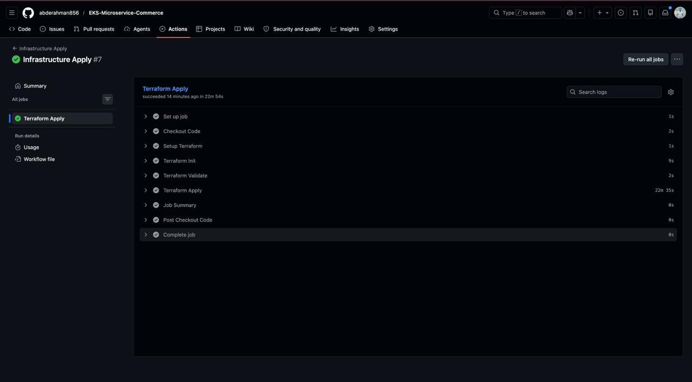

#### Destroy (`infrastructure-destroy.yaml`)

**Trigger:** Manual `workflow_dispatch` with confirmation input `DESTROY`

1. Optional Helm release cleanup (`ecommerce`)
2. Confirmation gate — aborts unless input equals `DESTROY`
3. `terraform destroy -auto-approve`

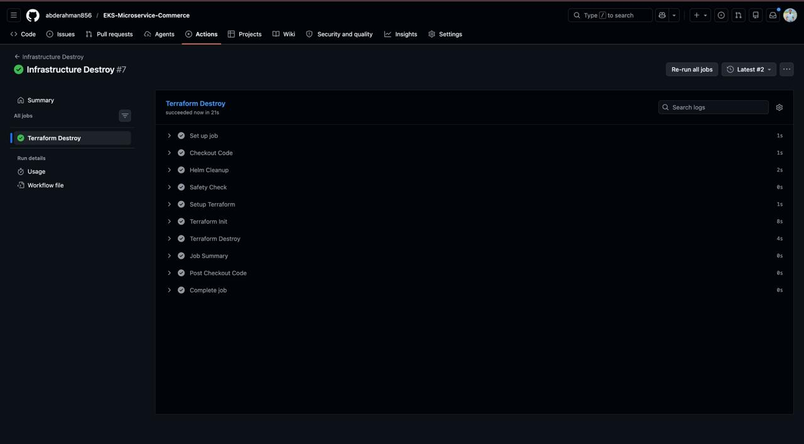

### Rollback Strategy

Rollback is Git-native:

1. Revert or cherry-pick the GitOps commit that updated `kubernetes/helm/values.yaml`
2. Argo CD self-heal syncs the previous image tag
3. Kubernetes performs a rolling update to the prior container image

Explicit blue/green or canary rollback is not implemented; see [Future Improvements](#future-improvements).

---

## Technology Stack

| Category | Technologies |
| --- | --- |
| **Frontend** | React 18, Vite, Tailwind CSS, React Router, Axios |
| **Backend** | Node.js, Express, bcryptjs, jsonwebtoken, pg |
| **Database** | PostgreSQL 16 (Amazon RDS) |
| **Cloud** | AWS (EKS, VPC, RDS, ECR, S3, KMS, CloudWatch) |
| **Containerization** | Docker (multi-stage builds, non-root runtime user on backend images) |
| **Orchestration** | Kubernetes, Helm 3 (umbrella chart with subcharts) |
| **Ingress & DNS** | NGINX Ingress Controller, ExternalDNS, Cloudflare |
| **TLS** | cert-manager, Let's Encrypt (DNS-01) |
| **GitOps** | Argo CD |
| **CI/CD** | GitHub Actions |
| **IaC** | Terraform ≥ 1.0 (AWS provider ~> 5.0) |
| **Security Scanning** | Trivy, Checkov, pre-commit hooks (detect-private-key, hadolint, tflint) |
| **Monitoring** | Prometheus, Grafana (kube-prometheus-stack) |
| **Logging** | CloudWatch (VPC Flow Logs, RDS PostgreSQL logs, EKS control-plane logs) |
| **Version Control** | Git, GitHub |

---

## Repository Structure

```text
.
├── .github/workflows/          # CI/CD pipeline definitions
│   ├── docker-build-push.yaml  # Build, scan, push, GitOps tag update
│   ├── infrastructure-plan.yaml
│   ├── infrastructure-apply.yaml
│   └── infrastructure-destroy.yaml
├── bootstrap/                  # One-time AWS bootstrap (state + ECR)
│   ├── s3/                     # Terraform remote state bucket
│   └── ecr/                    # ECR repositories for all services
├── database/
│   └── schema.sql              # PostgreSQL schema for auth_db and order_db
├── docs/
│   ├── API.md                  # REST endpoint reference
│   └── *.jpg / *.gif           # Architecture diagram and deployment screenshots
├── gitops/                     # Argo CD Application manifests
│   ├── root.yaml               # App-of-apps entry point
│   ├── ecommerce-app.yaml      # Helm chart Application
│   └── infra-apps.yaml         # Platform manifests Application
├── kubernetes/
│   ├── cert-manager/           # Let's Encrypt ClusterIssuer
│   ├── external-dns/           # Cloudflare DNS automation
│   ├── helm/                   # Umbrella Helm chart + per-service subcharts
│   ├── ingress/                # Ingress rules for app, Grafana, Prometheus, Argo CD
│   └── monitoring/             # kube-prometheus-stack values
├── services/
│   ├── auth/                   # Authentication microservice
│   ├── cart/                   # Shopping cart microservice
│   ├── frontend/               # React SPA
│   ├── notification/           # Notification microservice
│   ├── orders/                 # Order orchestration microservice
│   ├── payment/                # Payment simulation microservice
│   └── product/                # Product catalog microservice
├── terraform/                  # Main infrastructure modules
│   └── Modules/
│       ├── vpc/                # VPC, subnets, NAT, flow logs
│       ├── iam/                # EKS and flow-log IAM roles
│       ├── eks/                # EKS cluster and node group
│       └── rds/                # PostgreSQL instance and security group
├── compose.yaml                # Local Docker Compose (optional)
├── .pre-commit-config.yaml     # Local linting and security hooks
└── README.md
```

---

## Getting Started

### Prerequisites

| Tool | Purpose |
| --- | --- |
| AWS account with appropriate IAM permissions | Infrastructure and ECR |
| Terraform ≥ 1.0 | Infrastructure provisioning |
| AWS CLI | Cluster access and ECR login |
| kubectl | Kubernetes cluster interaction |
| Helm 3 | Chart rendering and local validation |
| Docker | Local image builds |
| Node.js 18+ | Local service development |
| pre-commit (optional) | Run hooks before pushing |

### 1. Clone the Repository

```bash
git clone https://github.com/abderahman856/EKS-Microservice-Commerce.git
cd EKS-Microservice-Commerce
```

### 2. Bootstrap Remote State and ECR

Run once before the main Terraform stack:

```bash
# S3 backend for Terraform state
cd bootstrap/s3
terraform init && terraform apply

# ECR repositories for all microservices
cd ../ecr
terraform init && terraform apply
```

Update `terraform/backend.tf` with your state bucket name if it differs from the default.

### 3. Provision Infrastructure

```bash
cd terraform
export TF_VAR_dbPassword="<your-db-password>"
export TF_VAR_jwtSecret="<your-jwt-secret>"
terraform init
terraform plan
terraform apply
```

Or trigger the **Infrastructure Apply** workflow in GitHub Actions after configuring repository secrets.

### 4. Configure kubectl

```bash
aws eks update-kubeconfig \
  --name baashe-devops-cluster \
  --region us-east-1
```

### 5. Install Platform Components

Install cluster add-ons before syncing applications:

- NGINX Ingress Controller
- cert-manager
- Argo CD
- kube-prometheus-stack (using values from `kubernetes/monitoring/kube-prometheus-stack/values.yaml`)

Create required secrets (do not commit real values):

```bash
kubectl create secret generic cloudflare-api-token-secret \
  --from-literal=api-token=<CLOUDFLARE_API_TOKEN> \
  -n cert-manager
```

Apply database credentials via Helm values or `kubernetes/helm/secrets-example.yaml` as a template. Populate `global.secrets` in `kubernetes/helm/values.yaml` before deploying.

### 6. Register GitOps Applications

```bash
kubectl apply -f gitops/root.yaml
```

Argo CD installs the ecommerce Helm release and platform manifests from the repository.

### Running Locally (without Kubernetes)

Start each service in a separate terminal. PostgreSQL must be reachable for auth and orders.

```bash
# Terminal 1 — Auth (port 3000)
cd services/auth && npm install && npm start

# Terminal 2 — Product (port 3000)
cd services/product && npm install && npm start

# Terminal 3 — Cart (port 3000)
cd services/cart && npm install && npm start

# Terminal 4 — Orders (port 3000)
cd services/orders && npm install && npm start

# Terminal 5 — Payment (port 3000)
cd services/payment && npm install && npm start

# Terminal 6 — Notification (port 3000)
cd services/notification && npm install && npm start

# Terminal 7 — Frontend (port 5173)
cd services/frontend && npm install && npm run dev
```

Update `services/frontend/src/api.js` to point at your local service ports if they differ from the defaults.

Initialize the database:

```bash
psql -h <host> -U dbadmin -f database/schema.sql
```

### Running with Docker Compose

A `compose.yaml` file is included for local multi-container runs. It expects external PostgreSQL credentials via environment variables (`DB_USER`, `DB_PASSWORD`, `RDS_ENDPOINT`). Review and adjust build contexts under `services/` before use.

```bash
export DB_USER=dbadmin
export DB_PASSWORD=<password>
export RDS_ENDPOINT=<postgres-host>
docker compose up --build
```

---

## Usage

### Live Application

The storefront is exposed at **https://baashe.uk** behind NGINX Ingress with a Let's Encrypt certificate.

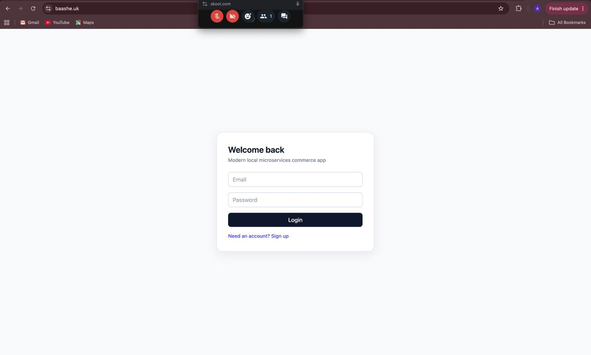

### Typical User Flow

1. Open the frontend and sign up or log in
2. Browse the product catalog (sourced from DummyJSON with local fallback)
3. Add items to the cart
4. Proceed to checkout — the order service coordinates payment and notification
5. View order history on the Orders page

### API Reference

Full endpoint documentation is in [`docs/API.md`](docs/API.md).

| Service | Key Endpoints |
| --- | --- |
| Auth | `POST /signup`, `POST /login` |
| Product | `GET /products` |
| Cart | `GET /cart`, `POST /cart/add`, `PUT /cart/update`, `DELETE /cart/remove`, `DELETE /cart/clear` |
| Order | `POST /orders`, `GET /orders` |
| Payment | `POST /pay` |
| Notification | `POST /notify` |

### Example: Authenticated Cart Request

```bash
TOKEN="<jwt-from-login>"

curl -s -H "Authorization: Bearer $TOKEN" \
  https://baashe.uk/api/cart/cart | jq
```

### Platform UIs

| UI | URL |
| --- | --- |
| Application | https://baashe.uk |
| Argo CD | https://argo.baashe.uk |
| Grafana | https://grafana.baashe.uk |
| Prometheus | https://prometheus.baashe.uk |

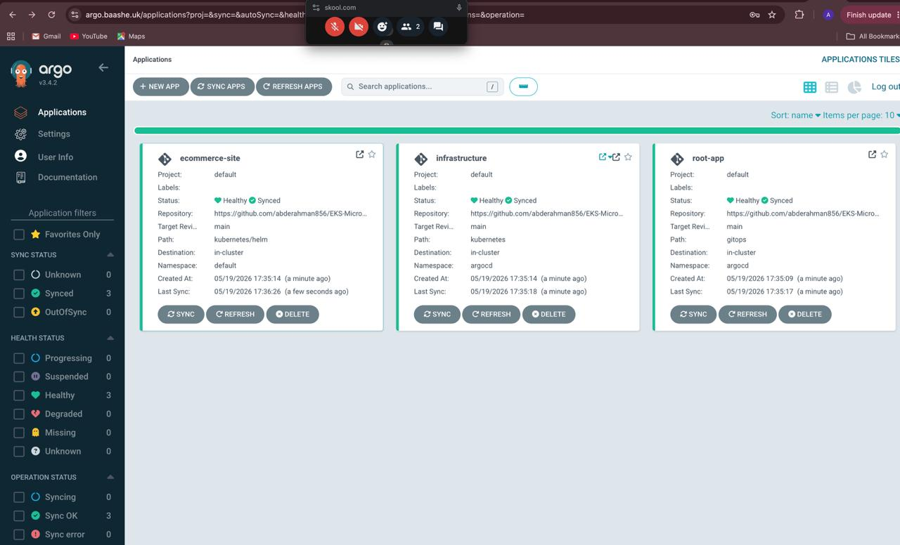

---

## Configuration

### GitHub Actions Secrets

| Secret | Used By |
| --- | --- |
| `AWS_ACCESS_KEY_ID` | All AWS workflows |
| `AWS_SECRET_ACCESS_KEY` | All AWS workflows |
| `DB_PASSWORD` | Terraform (`TF_VAR_dbPassword`) |
| `JWT_SECRET` | Terraform (`TF_VAR_jwtSecret`) |
| `GITOPS_PAT` | GitOps commit step in application pipeline |

### Terraform Variables

| Variable | Description | Required |
| --- | --- | --- |
| `dbPassword` | RDS master password | Yes (sensitive) |
| `jwtSecret` | JWT signing secret for auth/order services | Yes (sensitive) |
| `db_username` | RDS master username | No (default: `dbadmin`) |
| `vpc_cidr` | VPC CIDR block | No (default: `10.0.0.0/16`) |
| `project_name` | Resource naming prefix | No (default: `ecommerce-app`) |

### Helm Global Values (`kubernetes/helm/values.yaml`)

| Key | Purpose |
| --- | --- |
| `global.repository` | ECR registry URL |
| `global.image.tag` | Image tag promoted by CI (commit SHA) |
| `global.database.host` | RDS endpoint |
| `global.secrets.authDbPassword` | Auth database password |
| `global.secrets.orderDbPassword` | Order database password |
| `global.secrets.jwtSecret` | JWT signing key |
| `global.sharedEnv.*` | Inter-service URL configuration |

Use `kubernetes/helm/secrets-example.yaml` as a template. **Never commit production secrets to Git.**

### Service Environment Variables

Backend services read configuration from Kubernetes ConfigMaps and Secrets injected via `envFrom` in Helm templates. Locally, services fall back to defaults in source code (e.g., `JWT_SECRET=dev_secret_key`).

---

## Infrastructure

### Terraform Modules

```text
terraform/main.tf
├── module.vpc      → VPC, IGW, NAT, subnets, route tables, flow logs
├── module.iam      → EKS cluster/node roles, VPC flow log role
├── module.eks      → EKS cluster, node group, KMS secrets encryption
└── module.rds      → PostgreSQL Multi-AZ instance, subnet group, SG
```

### Networking

| Resource | Configuration |
| --- | --- |
| VPC CIDR | `10.0.0.0/16` |
| Public subnets | `10.0.1.0/24`, `10.0.2.0/24` (us-east-1a/b) |
| Private subnets | `10.0.10.0/24`, `10.0.11.0/24` |
| NAT Gateway | Single NAT in public subnet |
| EKS placement | Private subnets |
| RDS placement | Private subnets, not publicly accessible |

### Compute

| Resource | Specification |
| --- | --- |
| EKS cluster | `baashe-devops-cluster`, public API endpoint |
| Node group | `t3.small`, desired 3 / min 1 / max 3 |
| RDS | `db.t3.micro`, PostgreSQL 16.3, 20 GB gp2, Multi-AZ |

### IAM

- **EKS cluster role** — `AmazonEKSClusterPolicy`
- **Node group role** — worker node, CNI, and ECR read-only policies
- **VPC flow log role** — CloudWatch Logs write access
- **RDS monitoring role** — enhanced monitoring via `AmazonRDSEnhancedMonitoringRole`

### Storage & Registry

- **S3** — Terraform state with versioning, SSE, and public access blocked
- **ECR** — seven repositories (`<service>-service`), scan-on-push, keep last 10 images

### State Management

```hcl
backend "s3" {
  bucket  = "baashe-ecommerce-terraform-state"
  key     = "dev/eks-cluster/terraform.tfstate"
  region  = "us-east-1"
  encrypt = true
}
```

---

## Security

### Secret Management

- Sensitive Terraform variables (`dbPassword`, `jwtSecret`) are marked `sensitive` and supplied via CI secrets or environment variables
- Application credentials are stored in Kubernetes Secrets rendered from Helm values
- Cloudflare API token is referenced via `secretKeyRef` in ExternalDNS and cert-manager manifests

### Authentication & Authorization

- User-facing endpoints require a valid JWT (`Authorization: Bearer <token>`)
- Service-to-service calls from the order service use the `x-user-id` header after JWT verification
- Argo CD and Grafana access should be restricted in production (credentials configured at install time)

### Network Security

- Default VPC security group is locked down (no ingress/egress rules)
- RDS accepts PostgreSQL traffic only from the EKS cluster security group
- EKS secrets encrypted at rest with a dedicated KMS key

### Pipeline & Local Guardrails

- Trivy scans every built image before ECR push
- Checkov analyzes Terraform on every plan
- pre-commit runs `detect-private-key`, `terraform_validate`, `terraform_tflint`, `checkov`, and `hadolint`

> **Note:** Do not commit `.env` files, database passwords, JWT secrets, or Cloudflare tokens. The repository includes example templates only.

---

## Monitoring & Logging

### Metrics & Dashboards

The `kube-prometheus-stack` Helm chart deploys Prometheus and Grafana into the `monitoring` namespace. Custom values configure ingress, resource limits, and TLS for both components.

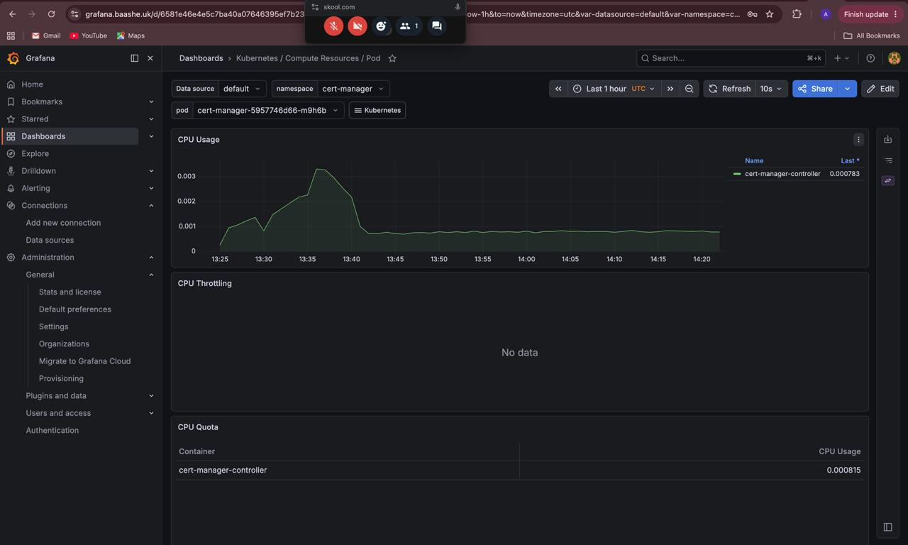

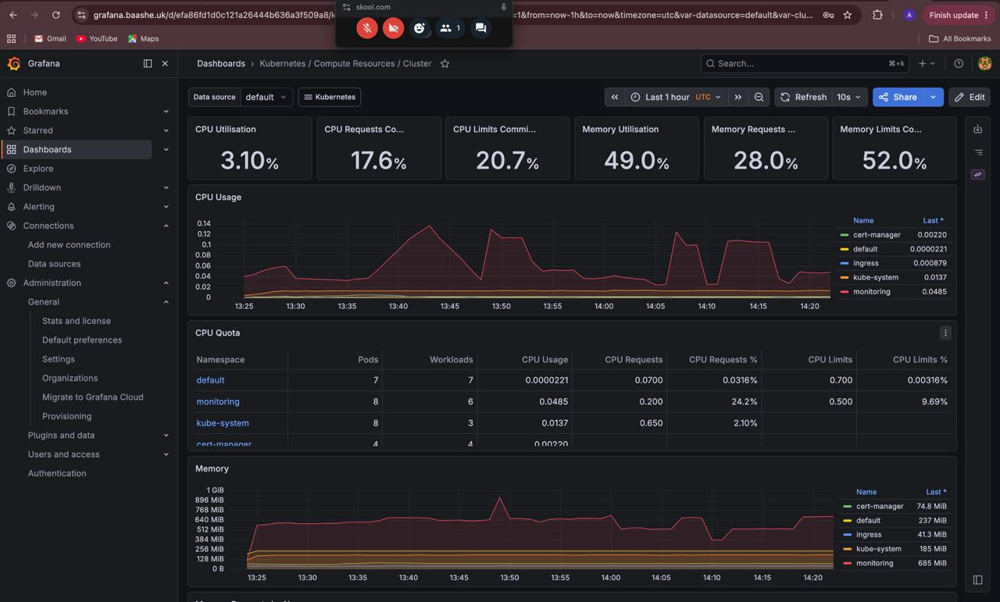

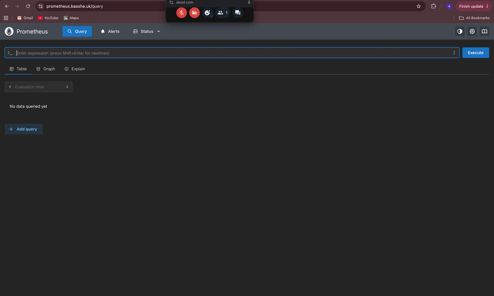

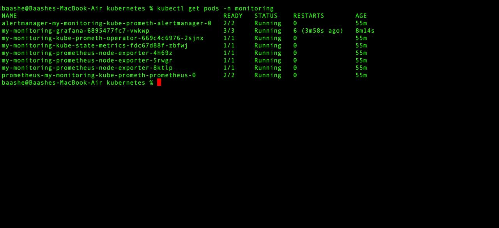

### Health Checks

Every backend microservice exposes `GET /health`:

```json
{ "status": "ok", "service": "auth" }
```

Auth service Docker images include a `HEALTHCHECK` instruction. Kubernetes readiness/liveness probes can be added as a follow-up.

### Logs

| Source | Destination |
| --- | --- |
| EKS control plane | CloudWatch (`api`, `audit`, `authenticator`, `controllerManager`, `scheduler`) |
| VPC traffic | CloudWatch Flow Logs (7-day retention) |
| RDS | CloudWatch (`postgresql`, `upgrade` log exports) |
| Application stdout | Container logs via `kubectl logs` |

---

## Testing

### Automated Tests

The repository does not currently include unit or integration test suites. Validation is performed through:

- `terraform validate` and `terraform plan` in CI
- Checkov and Trivy security scanning
- pre-commit hooks for formatting and linting
- Manual end-to-end verification of the storefront flow

### Manual Verification

```bash
# Service health
kubectl get pods
curl -s https://baashe.uk/api/auth/health | jq

# Argo CD sync status
kubectl get applications -n argocd

# Prometheus targets
kubectl port-forward -n monitoring svc/my-monitoring-kube-prometh-prometheus 9090:9090
```

### Pre-commit (Local)

```bash
pip install pre-commit
pre-commit install
pre-commit run --all-files
```

---

## Screenshots

| Screenshot | Description |
| --- | --- |
| [Architecture diagram](docs/Architecture-diagram.gif) | End-to-end system topology |
| [Application](docs/app-with-custom-domain.jpg) | Storefront on `baashe.uk` with HTTPS |
| [CI/CD pipeline](docs/docker-build-push-scan-gitops.jpg) | Build, Trivy scan, ECR push, GitOps update |
| [Terraform plan](docs/terraform-plan-and-security.jpg) | Plan output with Checkov findings |
| [Terraform apply](docs/terraform-apply.jpg) | Successful infrastructure deployment |
| [Terraform destroy](docs/terraform-destroy.jpg) | Guarded destroy workflow |
| [Argo CD](docs/argoCd-with-app-infra-synced.jpg) | Application and infrastructure apps in sync |
| [Grafana](docs/grafana-custom-domain.jpg) | Grafana over TLS |
| [Prometheus](docs/promothues-custom-domain.jpg) | Prometheus UI |

---

## Challenges & Solutions

### Separating Application and Platform GitOps Paths

**Problem:** A single Argo CD Application pointing at `kubernetes/` would deploy both raw manifests and the Helm chart, causing duplicate or conflicting resources.

**Solution:** Split into two Applications—`ecommerce-site` targets `kubernetes/helm/`, while `infrastructure` recursively syncs `kubernetes/` with `exclude: 'helm/*'`. A `root-app` Application bootstraps both.

### Image Tag Promotion Without a Separate GitOps Repo

**Problem:** The cluster must run the exact image built by CI, but manual tag edits are error-prone.

**Solution:** The application pipeline uses `yq` to set `global.image.tag` to the commit SHA, commits to `main` with `[skip ci]`, and lets Argo CD reconcile. The desired state always lives in Git.

### TLS and DNS on a Custom Domain

**Problem:** Manual certificate renewal and DNS record management do not scale.

**Solution:** cert-manager performs DNS-01 challenges through Cloudflare; ExternalDNS watches Ingress resources and creates matching DNS records for `baashe.uk` and subdomains.

### RDS Connectivity from EKS

**Problem:** The database must be reachable by pods but not from the public internet.

**Solution:** RDS resides in private subnets with `publicly_accessible = false`. A dedicated security group allows port 5432 ingress only from the EKS cluster security group.

### Product Catalog Resilience

**Problem:** An external product API outage would break the storefront.

**Solution:** The product service catches DummyJSON failures and serves a curated local fallback catalog so the UI remains functional.

---

## Lessons Learned

- **GitOps works best when the deployable artifact and its tag live in the same repository as the application code**, eliminating drift between CI output and cluster state.
- **Bootstrap Terraform separately from the main stack** so state buckets and ECR repositories exist before the primary backend is configured.
- **Splitting platform manifests from application Helm charts** keeps Argo CD sync boundaries clear and simplifies blast-radius reasoning.
- **Security scanning belongs in the pipeline, not as an afterthought** — Checkov on infrastructure changes and Trivy on images catch issues before deployment.
- **Multi-AZ RDS and encrypted storage are low-effort defaults** that significantly improve resilience over single-instance dev databases.
- **In-memory cart storage simplifies development** but is a deliberate trade-off; production systems would externalize session state to Redis or a database.

---

## Future Improvements

| Area | Enhancement |
| --- | --- |
| Deployment | Canary or blue/green releases with Argo Rollouts |
| Scaling | Horizontal Pod Autoscaler based on CPU or custom metrics |
| Data | Redis-backed cart persistence; read replicas for RDS |
| Observability | Centralized logging with Loki or OpenSearch; Alertmanager routing |
| Security | IRSA for pod-level AWS permissions; Sealed Secrets or External Secrets Operator |
| CI/CD | Blocking Trivy gate for CRITICAL findings; integration test stage |
| Infrastructure | Terraform workspaces for staging/production; RDS deletion protection |
| Networking | AWS Load Balancer Controller as an alternative to NGINX |
| Resilience | Multi-environment GitOps with Kustomize overlays or Helm values per env |

---

## Contributing

Contributions are welcome. Please follow these steps:

1. Fork the repository and create a feature branch from `main`
2. Install pre-commit hooks and ensure they pass locally
3. Keep changes focused; avoid unrelated refactors
4. Run `terraform fmt` and `terraform validate` for infrastructure changes
5. Open a pull request with a clear description of the change and its motivation

For infrastructure changes, the **Terraform Plan** workflow must pass on your pull request before merge.

---

## Author

| | |
| --- | --- |
| **Name** | Abdurahman |
| **LinkedIn** | https://www.linkedin.com/in/abdurahman-za-eed-15a365410/ |
| **GitHub** | https://github.com/abderahman856 |

Built and maintained as a portfolio project demonstrating production-style DevOps practices on AWS EKS.
